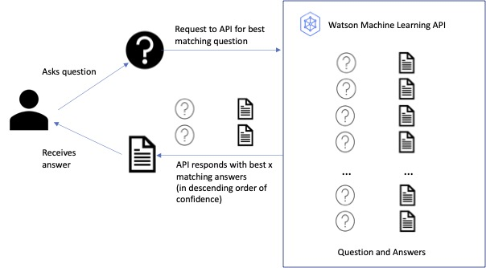

# Deploying a semantic search model as a fast real-time API using Watson Machine Learning


##  Background

This repository contains a sample notebook to deploy a fast and efficient NLP semantic search algorithm using Watson Machine Learning, part of IBM's multi-cloud Enterprise Data and AI platform, Cloud Pak for Data. 

The notebook uses HuggingFace's sentence-transformers model, mapping sentences and paragraphs to a dimensional dense vector space and can be used for tasks like clustering or semantic search. For more details see this [link](https://huggingface.co/sentence-transformers/all-MiniLM-L6-v2)


Watson Machine Learning enables Data Scientists to deploy open source and IBM specific models for both batch and real time API. This notebook builds and deploys a Sentence Transformer model as a Python function in Watson Machine Learning. 

Watson Machine Learning will deploy this model as a secure API endpoint which can be called by other applications.

This repository contains the following notebook

- SemanticSearch_WatsonML.ipynb

which details the steps to deploy a search based function as a Watson ML API.


##  Use case

A user would type in a question and content returned would be the closest match from a repository of questions, with answers (as shown in the diagram below). The user would ask their question and then receive the most appropriate answer back from a knowledge base of questions, receiving the answer with the highest relevance. This function could be called by an AI Chatbot such as Watson Assistant.



##  Data
The data set we will use to demonstrate this solution is a publicly available and can be downloaded from here (I have also included the version I use in this github repo).

- tweetqa_train.json

The original version of this data was sourced from [HuggingFace](https://huggingface.co/datasets/tweet_qa/viewer/default/train)


##  Pre-requisites for notebook

[Provisioning of Watson Machine Learning Service](#provisionWML)

[Associate service with Watson Studio Project with Watson ML Service](#associate)

[Required api keys and crns](#keyscrn)

<a id="provisionWML"></a>
## Provisioning of Watson Machine Learning Service

To run the notebook in this blog post, you will need to provision Watson Studio and Watson Machine Learning services. Go to the [IBM Cloud Catalog](https://cloud.ibm.com/catalog). For further help on provisioning a Watson Machine Learning service, see [here](https://dataplatform.cloud.ibm.com/docs/content/wsj/analyze-data/ml-service-instance.html?context=analytics)

Once you have provisioned your Watson Studio service, launch the service and create a new Watson Studio project.

<a id="associate"></a>
## Associate your Watson Studio Project with Watson ML Service

From your Watson Studio project, associate your Watson Machine Learning service with the project. 

Select Manage>Services & Integrations>Associate Service

<a id="projectkey"></a>
## Create project token

Open up the notebook in Cloud Pak for Data in edit mode and insert a blank cell at the top of the notebook and select insert project token


<a id="keyscrn"></a>
## Provisioning of Watson Machine Learning Service

To run the notebook in the github repository the following information and keys need to be supplied:

- Cloud API Key (`api_key`)

- Cloud Object Storage (`resource_instance_crn`)

- Watson Machine Learning (`display_name` and `crn`)

### Cloud API Key

Go to [IBM Cloud Overview](https://cloud.ibm.com/catalog) link.

Select API Key from the left-hand side menu. Click create and give your API key a name and description. Copy and download your key.

The API key would be inserted in the notebook
 
```
api_key = 'PASTE THE CLOUD API KEY'
location = 'PASTE LOCATION'
```

### Cloud Object Storage

Go to the Manage tab of your Watson Studio project and under the Storage section on the right hand side click Manage in IBM Cloud.

> Create a new credential. Expand the section and make a note of the  `resource_instance_id` and paste it into the main notebook below as `cos_resource_crn`


### Watson Machine Learning

Go to https://cloud.ibm.com/resources

Locate the Watson Machine Learning service you provisioned. Select Export Access Report

```
space_name = 'PASTE THE WATSON ML DEPLOYMENT SPACE NAME'
wml_service_name = 'PASTE THE WATSON ML SERVICE NAME'
wml_crn = 'PASTE THE WATSON ML CRN'
cos_resource_crn = 'PASTE THE COS RESOURCE CRN'

```


